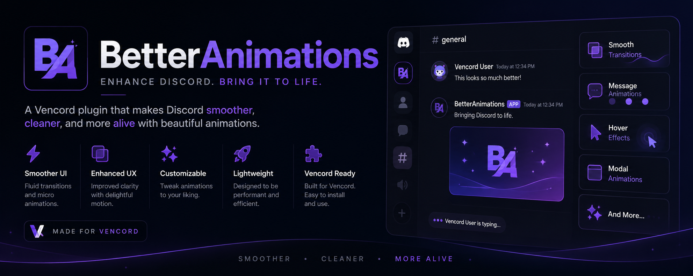

# BetterAnimations

<p align="center">
  
</p>


Make Discord feel smoother with BetterAnimations! Transform the look and feel of Discord with improved animations and transitions.

---

# Requirements

Before installing BetterAnimations, make sure you have the following installed:

### 1. Git

Download Git for Windows:

https://git-scm.com/install/windows

### 2. Discord Desktop

Make sure the **Discord desktop application** is installed.

### 3. UserPlugins Folder

Download the `userplugins` folder here:

https://drive.google.com/drive/folders/1YqK1TjD8bo89cTzpCyGJH5RF-pYZYObG?usp=drive_link

---

# Installation

## Step 1

Press **Windows + R**, type:

```text
cmd
```

and press **Enter**.

---

## Step 2

Go to your Downloads folder:

```bash
cd Downloads
```

---

## Step 3

Clone the Vencord repository:

```bash
git clone https://github.com/Vendicated/Vencord.git
```

---

## Step 4

Move the downloaded `userplugins` folder into:

```text
Vencord/src/
```

Your folder structure should look like:

```text
Vencord
└── src
    └── userplugins
```

---

## Step 5

Open the Vencord folder:

```bash
cd Vencord
```

---

## Step 6

Install the required packages:

```bash
pnpm install
```

---

## Step 7

Build Vencord:

```bash
pnpm build
```

---

## Step 8

Inject Vencord into Discord:

```bash
pnpm inject
```

If prompted to select your Discord installation, simply press **Enter** to use the default location.

---

## Step 9

Restart Discord.

---

# Enable BetterAnimations

1. Open **Discord**.
2. Go to **User Settings**.
3. Click **Plugins**.
4. Search for **BetterAnimations**.
5. Enable the plugin.

🎉 **That's it! BetterAnimations is now installed.**

---

# Requirements Checklist

* ✅ Windows
* ✅ Discord Desktop
* ✅ Git
* ✅ pnpm
* ✅ Internet Connection

---

# Need Help?

<p align="center">
  
</p>


If you're having trouble installing BetterAnimations, watch the video guide:

**Video Guide:** *(Add your video link here)*

You can also open an issue on GitHub if you encounter any bugs or installation problems.
